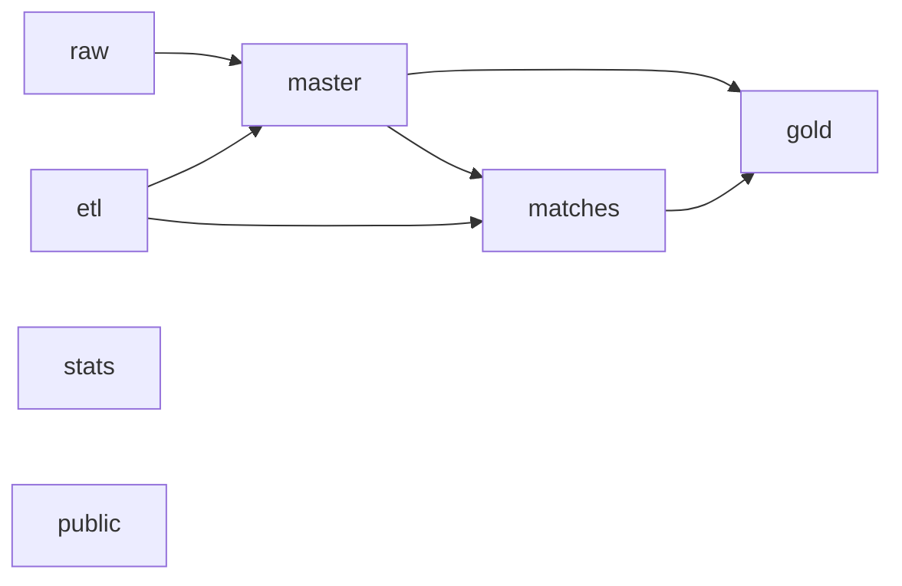
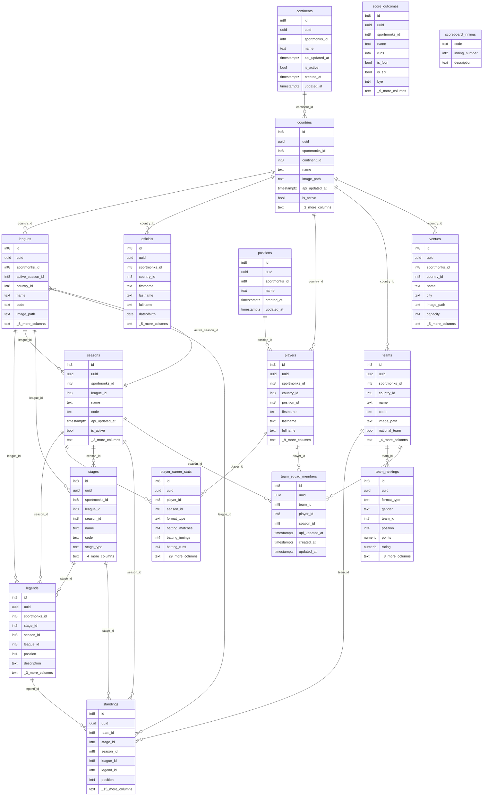
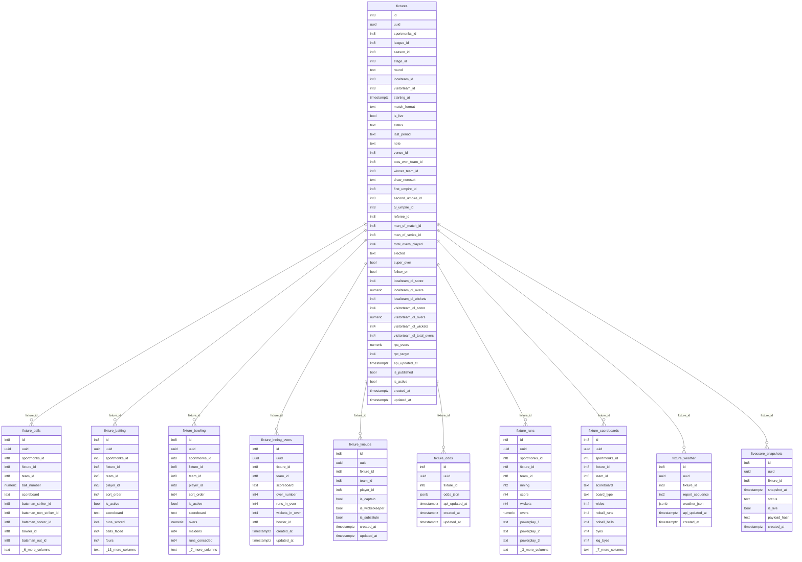
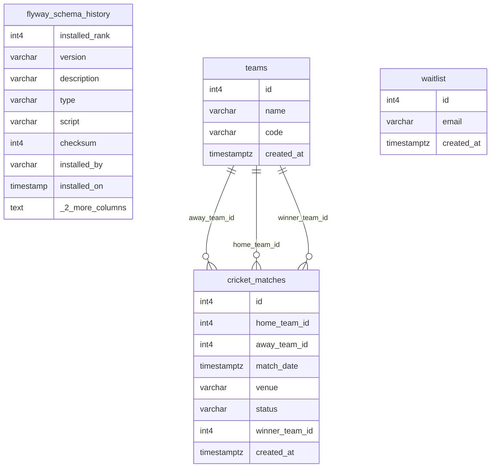
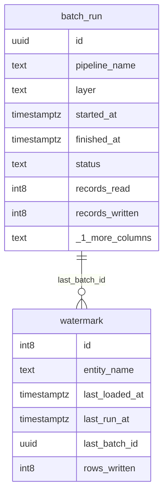
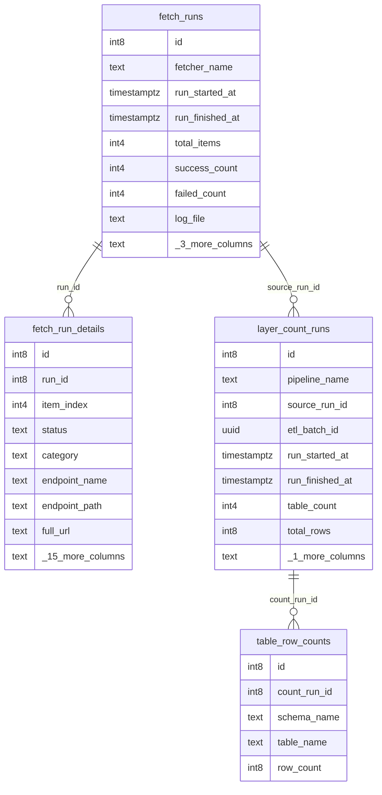
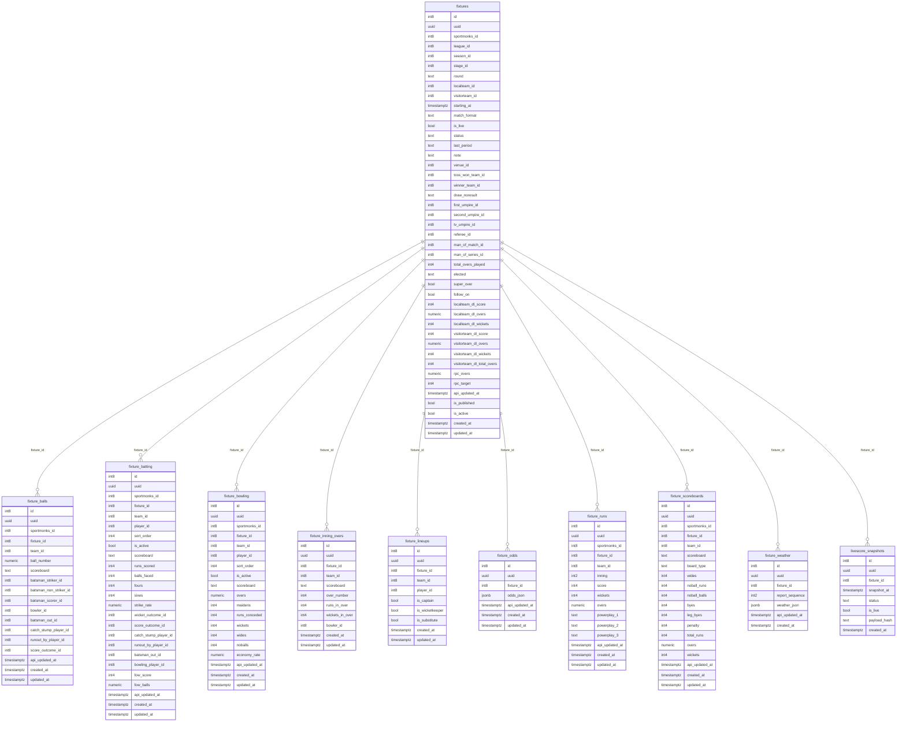

# Cricket AI — Entity Relationship Diagrams

> Generated 2026-07-15 11:10:25.657404+00. Diagrams split by schema for readability.

## Architecture overview

## master

## matches

> Aligns with data team diagram `cricket_ai_dev - cricket_ai_dev - matches.png`. See `DATA_TEAM_ALIGNMENT.md` for alias mapping.

## raw

```mermaid
erDiagram
  api_ingest {
    int8 id
    text source_file
    jsonb payload
    timestamptz ingested_at
    text checksum
  }
  continents {
    int8 id
    int8 sportmonks_id
    jsonb data
    timestamptz api_updated_at
    timestamptz loaded_at
  }
  countries {
    int8 id
    int8 sportmonks_id
    jsonb data
    timestamptz api_updated_at
    timestamptz loaded_at
  }
  cricket_all_matches {
    text info
    text innings
    text meta
  }
  fixture_includes {
    int8 id
    int8 fixture_id
    text include_param
    jsonb data
    timestamptz api_updated_at
    timestamptz loaded_at
  }
  fixtures {
    int8 id
    int8 sportmonks_id
    jsonb data
    timestamptz api_updated_at
    timestamptz loaded_at
  }
  id_fixture_includes {
    int8 id
    int8 fixture_id
    text include_param
    jsonb data
    timestamptz api_updated_at
    timestamptz loaded_at
  }
  id_player_career {
    int8 id
    int8 player_id
    jsonb data
    timestamptz api_updated_at
    timestamptz loaded_at
  }
  id_squads {
    int8 id
    int8 team_id
    int8 season_id
    jsonb data
    timestamptz api_updated_at
    timestamptz loaded_at
  }
  id_standings_season {
    int8 id
    int8 season_id
    jsonb data
    timestamptz api_updated_at
    timestamptz loaded_at
  }
  id_standings_stage {
    int8 id
    int8 stage_id
    jsonb data
    timestamptz api_updated_at
    timestamptz loaded_at
  }
  ipl_matches {
    jsonb info
    jsonb innings
    jsonb meta
  }
  leagues {
    int8 id
    int8 sportmonks_id
    jsonb data
    timestamptz api_updated_at
    timestamptz loaded_at
  }
  livescores {
    int8 id
    int8 sportmonks_id
    jsonb data
    timestamptz api_updated_at
    timestamptz loaded_at
  }
  officials {
    int8 id
    int8 sportmonks_id
    jsonb data
    timestamptz api_updated_at
    timestamptz loaded_at
  }
  player_career {
    int8 id
    int8 player_id
    jsonb data
    timestamptz api_updated_at
    timestamptz loaded_at
  }
  players {
    int8 id
    int8 sportmonks_id
    jsonb data
    timestamptz api_updated_at
    timestamptz loaded_at
  }
  positions {
    int8 id
    int8 sportmonks_id
    jsonb data
    timestamptz api_updated_at
    timestamptz loaded_at
  }
  scores {
    int8 id
    int8 sportmonks_id
    jsonb data
    timestamptz api_updated_at
    timestamptz loaded_at
  }
  seasons {
    int8 id
    int8 sportmonks_id
    jsonb data
    timestamptz api_updated_at
    timestamptz loaded_at
  }
  squads {
    int8 id
    int8 team_id
    int8 season_id
    jsonb data
    timestamptz api_updated_at
    timestamptz loaded_at
  }
  stages {
    int8 id
    int8 sportmonks_id
    jsonb data
    timestamptz api_updated_at
    timestamptz loaded_at
  }
  standings_season {
    int8 id
    int8 season_id
    jsonb data
    timestamptz api_updated_at
    timestamptz loaded_at
  }
  standings_stage {
    int8 id
    int8 stage_id
    jsonb data
    timestamptz api_updated_at
    timestamptz loaded_at
  }
  team_rankings {
    int8 id
    text ranking_type
    text gender
    jsonb data
    timestamptz api_updated_at
    timestamptz loaded_at
  }
  teams {
    int8 id
    int8 sportmonks_id
    jsonb data
    timestamptz api_updated_at
    timestamptz loaded_at
  }
  venues {
    int8 id
    int8 sportmonks_id
    jsonb data
    timestamptz api_updated_at
    timestamptz loaded_at
  }
```

## public

## etl

## stats

## matches (full columns)

For every column on `fixtures` and all child tables, open `ER_DIAGRAM_MATCHES_FULL.mmd` or the data team PNG.

## Gold layer views

The `gold` schema contains 21 analytical views (dim_*, fact_*, v_fixture_summary) built over master and matches. See `SCHEMA.md` for the view list.
